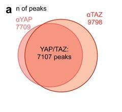
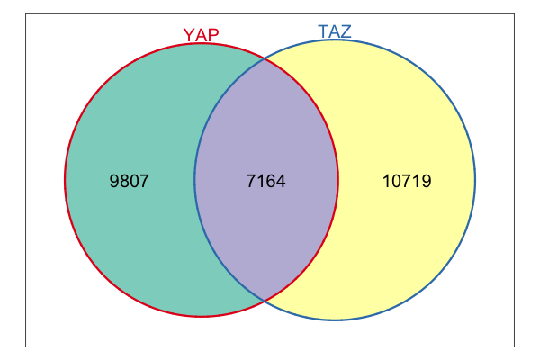
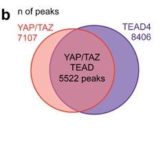
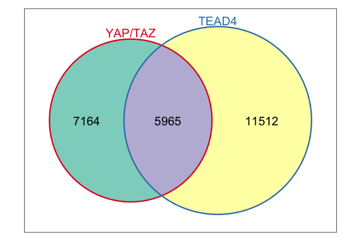
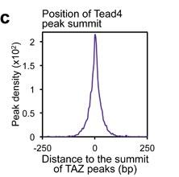
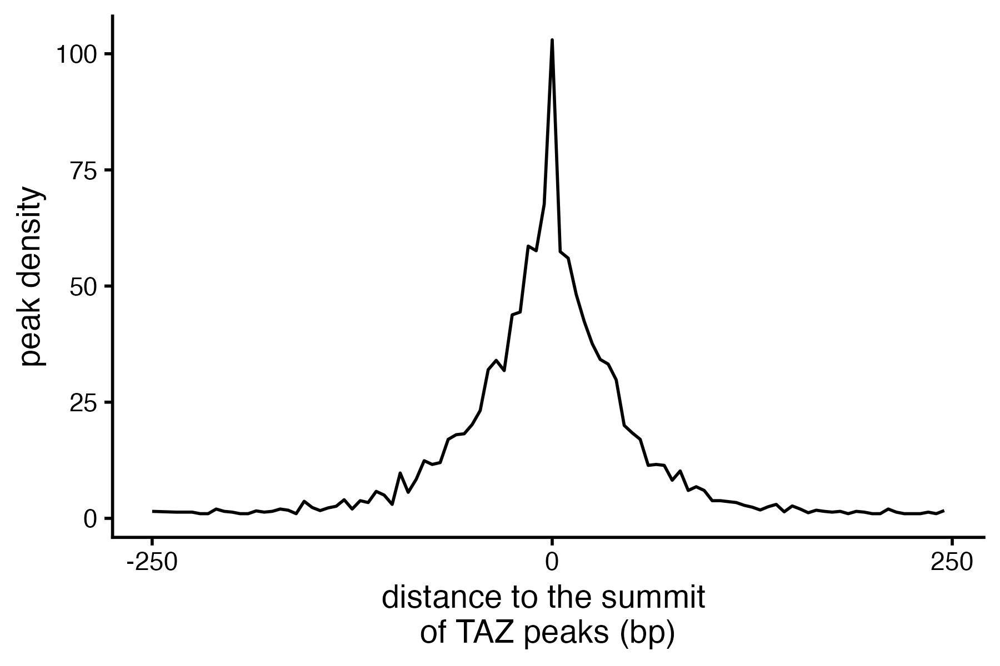

# ChIP-seq Analysis of YAP/TAZ/TEAD4 Co-binding

Reproducing Figure 1 from [Zanconato et al. 2018](https://pmc.ncbi.nlm.nih.gov/articles/PMC6186417/) using ChIP-seq data for the Hippo pathway effectors YAP, TAZ, and TEAD4. Based on Tommy Tang's [ChIP-seq tutorial](https://www.youtube.com/@crazyhottommy).

## Results

### Paper (Fig 1a–c) vs My Reproduction

| | Paper | My reproduction |
|:---:|:---:|:---:|
| **Fig 1a** |  |  |
| YAP vs TAZ overlap | 7,107 peaks | 7,164 peaks |
| **Fig 1b** |  |  |
| YAP/TAZ vs TEAD4 overlap | 5,522 peaks | 5,965 peaks |
| **Fig 1c** |  |  |
| TEAD4 summit distance to TAZ peaks | Sharp peak at 0 bp | Sharp peak at 0 bp |

## Pipeline

**Upstream (bash):**
FASTQ → Bowtie2 alignment → BAM sorting/indexing → BigWig generation → MACS2 peak calling → bedtools multicov

**Downstream (R):**
- Venn diagrams of YAP/TAZ and YAP-TAZ/TEAD4 peak overlaps (`fig1_a_b_c.R`)
- TEAD4 summit distance relative to TAZ peaks — peak density plot
- Common peak identification and read count quantification (`fig 1 def.R`)

## Scripts

| File | Description |
|------|-------------|
| `fig1_a_b_c.R` | Peak overlap Venn diagrams and TEAD4 summit distance analysis |
| `fig 1 def.R` | Common YAP/TAZ/TEAD4 peak export and bedtools multicov |

## Tech Stack

R · GenomicRanges · rtracklayer · ggplot2 · Bowtie2 · MACS2 · bedtools
