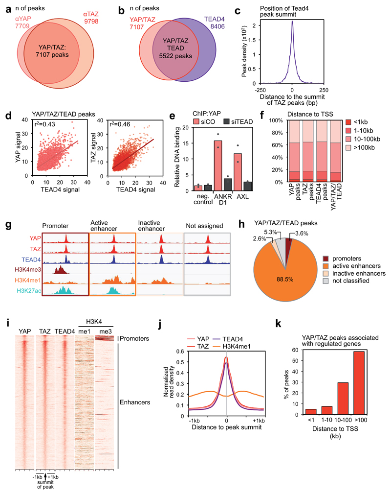

# ChIP-seq Analysis of YAP/TAZ/TEAD4 Co-binding

Reproducing Figure 1 from [Zanconato et al. 2018](https://pmc.ncbi.nlm.nih.gov/articles/PMC6186417/) using ChIP-seq data for the Hippo pathway effectors YAP, TAZ, and TEAD4. Based on Tommy Tang's [ChIP-seq tutorial](https://www.youtube.com/@crazyhottommy).

## Results

### Paper (Fig 1a–c) vs My Reproduction

| Paper | My reproduction |
|:---:|:---:|
|  |  |
| Fig 1b: YAP/TAZ–TEAD4 overlap (5,522 peaks) | My result: 5,965 shared peaks |

| Paper (Fig 1c) | My reproduction |
|:---:|:---:|
| TEAD4 summit density centered on TAZ peaks |  |

Peak counts and summit distance profile closely match the published results.

## Pipeline

**Upstream (bash):**
FASTQ → Bowtie2 alignment → BAM sorting/indexing → BigWig generation → MACS2 peak calling → bedtools multicov

**Downstream (R):**
- Venn diagrams of YAP/TAZ and YAP-TAZ/TEAD4 peak overlaps (`fig1_a_b_c.R`)
- TEAD4 summit distance relative to TAZ peaks — peak density plot
- Common peak identification and read count quantification (`fig 1 def.R`)

## Scripts

| File | Description |
|------|-------------|
| `fig1_a_b_c.R` | Peak overlap Venn diagrams and TEAD4 summit distance analysis |
| `fig 1 def.R` | Common YAP/TAZ/TEAD4 peak export and bedtools multicov |

## Tech Stack

R · GenomicRanges · rtracklayer · ggplot2 · Bowtie2 · MACS2 · bedtools
